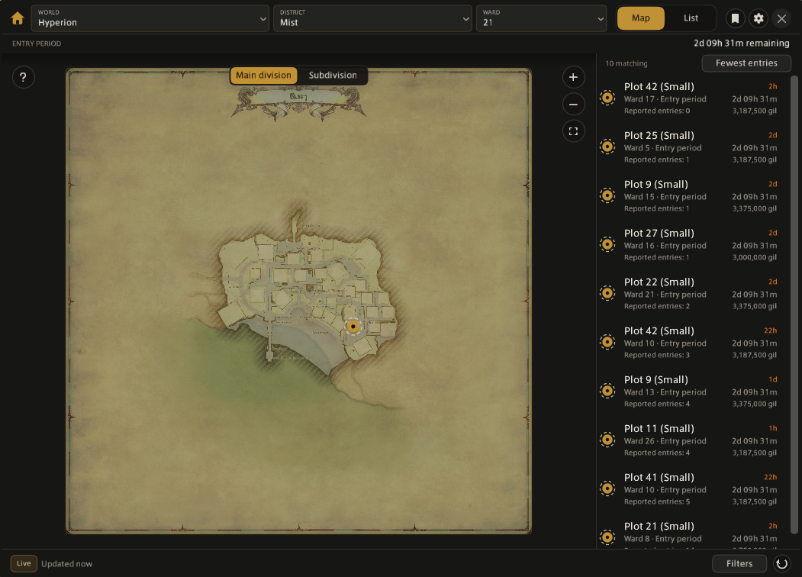
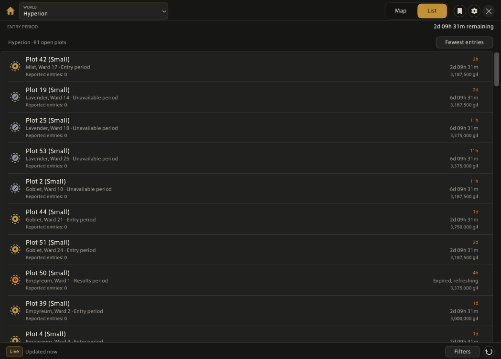

# Placard

A Dalamud plugin for finding open housing plots in FFXIV, on the real in-game district maps.

Placard covers Mist, The Lavender Beds, The Goblet, Shirogane and Empyreum on every world, and tracks the lottery through the entry and results periods.

## Two ways to look

**Map** draws the open plots onto the actual district map, read from your own game files. A side list beside it shows the same plots as rows, so you can read the ward at a glance and still see where a plot physically sits.

**List** drops the map and shows every open plot on the world in one table, across all five districts at once. Pick a world, sort, and scan. Clicking a row takes you to that plot on the map.

Switch between them with the Map / List control in the toolbar. Placard remembers which one you were last in.

## Reading a plot

Markers encode two things without relying on colour alone: the shape is the plot size, and the inner mark is the lottery phase. Each plot carries its price, entry count, purchase eligibility and how long ago it was last scanned.

Sort the list by fewest entries, scan age, plot size, price, or ward and plot. Filter on size, lottery phase, eligibility, main division or subdivision, and a cap on entries, so you can ask for something like "small plots, entry period, under three bids" and get the whole world's answer.

## Watchlist and reminders

Bookmark any plot and Placard keeps it in a watchlist with its current phase and entry count. Set a reminder and you get a Dalamud notification before the phase deadline, with separate toggles for entry and results periods.

If you have [Lifestream](https://github.com/NightmareXIV/Lifestream) installed, plots get a Travel Here button that takes you to the ward. Placard works fine without it; the button just dims.

## Installing

Placard is not yet in the official Dalamud repository. Until it is, add it as a custom repository in `/xlsettings` → Experimental.

Open it with `/placard`.

## Where the data comes from

Open plot data comes from `housing-api.yozoracho.dev`, a small caching service I run that polls the public [PaissaDB](https://github.com/zhudotexe/FFXIV_PaissaHouse) API once and serves the result to all Placard users, rather than every client polling PaissaDB separately.

Placard makes one kind of outbound request: a GET for the world you are looking at. It sends no account, character or location information, and it has no telemetry. Requests are conditional on an ETag, so an unchanged world costs a 304 and nothing else. The default poll is every 20 minutes and only while the window is open, because ward data only changes when a player physically walks the ward.

The PaissaHouse plugin is not required. Placard does not scan or submit housing data itself.

District maps and plot positions are read from your own game installation through `TerritoryType`, `Map` and `HousingMapMarkerInfo`. Textures are referenced by game path, so nothing is extracted or redistributed.

Placard covers the global data centres. The China and Korea regions are not in the upstream data and are not supported.

## Languages

English, German, Spanish, French, Japanese, Portuguese, Russian, Turkish and Chinese. Translations outside English are machine assisted and have not all been checked by native speakers, so corrections are very welcome, particularly around housing terminology.

## Origins

Placard began as the Housing app inside [Aetherphone](https://github.com/XeldarAlz/FFXIV-Aetherphone), which I contributed to. Most of it carries over from that work: the housing data layer, the map rendering and plot markers, the filters, and the world and ward pickers. What changed is the shell. The phone frame is gone, replaced by a resizable desktop window with the map and a plot list side by side, and the list now spans a whole world instead of one district.

Placard shares no code with Aetherphone at runtime, and neither plugin requires the other. AI usage is declared in [AI-DECLARATION.md](AI-DECLARATION.md).

## License

AGPL-3.0. See LICENSE.md.